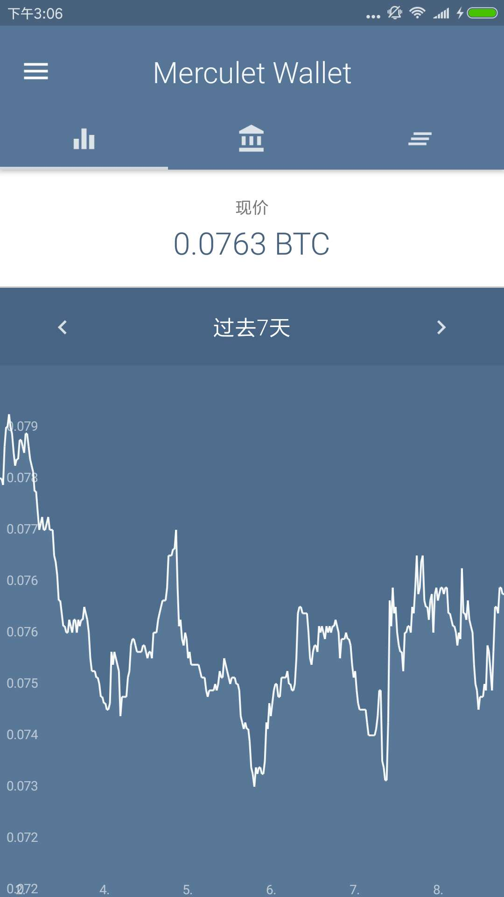
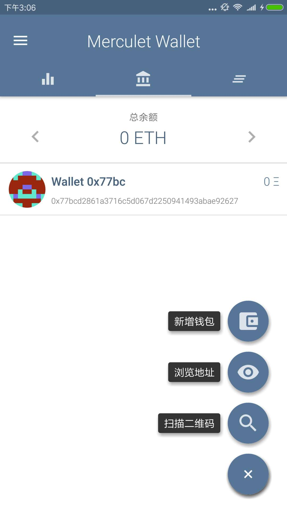
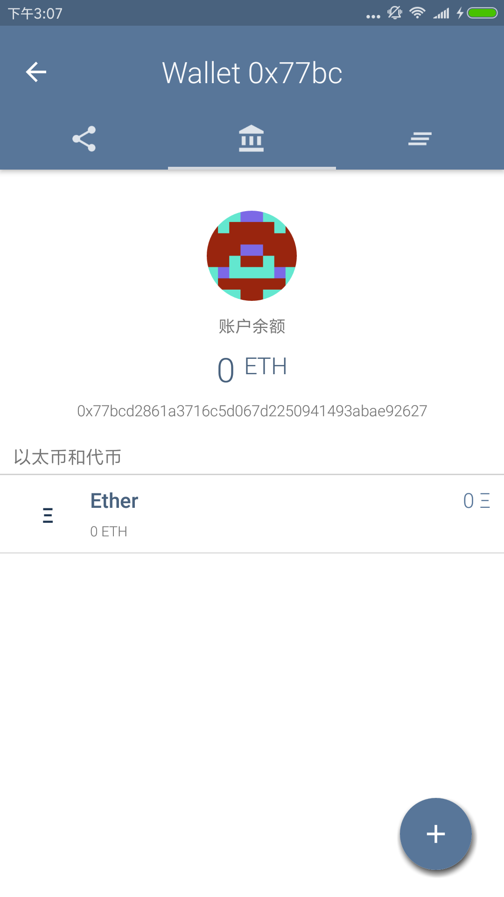
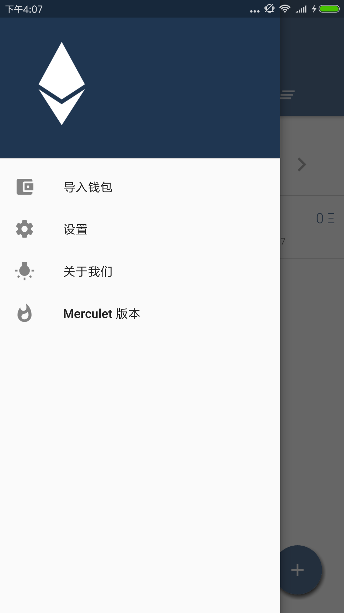

# ETH_Wallet_Kotlin
根据[Lunary-Ethereum-Wallet](https://github.com/manuelsc/Lunary-Ethereum-Wallet)修改的Kotlin版本

## Features
* 支持多钱包  
* 支持只读钱包 
* 发送/请求付款 
* 支持代币  
* 消息通知 
* 交易历史 
* Addressbook and address naming  
* 钱包导入/导出 
* 支持ETH,USD或BTC单位显示
* 不需要注册登录 
* 价格历史图表
* 指纹/密码保护
* 支持ERC-67和ICAP
* 现在支持8种货币: USD, EUR, GBP, CHF, AUD, CAD, JPY, RUB  
* 支持 中文、英语、德语、西班牙语、葡萄牙语和匈牙利语

## Dependencies:
* [Web3j](https://github.com/web3j/web3j)
* [FloatingActionButton](https://github.com/Clans/FloatingActionButton)
* [MaterialDrawer](https://github.com/mikepenz/MaterialDrawer)
* [MPAndroidChart](https://github.com/PhilJay/MPAndroidChart)
* [zxing](https://github.com/zxing/zxing)
* [RateThisApp](https://github.com/kobakei/Android-RateThisApp)
* [AppIntro](https://github.com/apl-devs/AppIntro)

## Web APIs:
* [Etherscan.io](https://etherscan.io/)  
* [Poloniex.com](https://poloniex.com/)  
* [Ethplorer.io](https://ethplorer.io)

